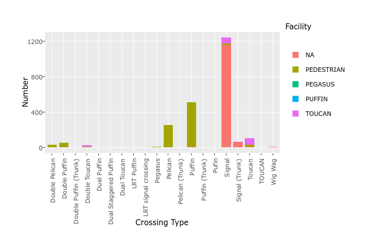

## Loading the data
We will use the Manchester traffic signals dataset.  
Firsly we need to load our libraries and do some basic tidying.


```r
library(plotly)
traffic <- read.csv("../TrafficSignals.csv")
```


A quick tidy.  


```r
traffic$Crossing_Facility <- gsub("P(ed|ED).*","PEDESTRIAN", traffic$Crossing_Facility)
traffic$Crossing_Facility <- gsub("P(uf|UF).*","PUFFIN", traffic$Crossing_Facility)
traffic$Crossing_Facility[traffic$Crossing_Facility==""] <- "NA"
```

---

## Let's plot!

```r
qTraffic <- qplot(Type, data = traffic, fill=Crossing_Facility, 
                  xlab="Crossing Type", ylab="Number")+
  theme(axis.text.x = element_text(angle=90))+labs(fill="Facility")

ggplotly(qTraffic)
```



---

## The interactive chart
### Using an iframe
<iframe src="https://plot.ly/~simbosky/0.embed" width="800" height="600" id="igraph" scrolling="no" seamless="seamless" frameBorder="0"> </iframe>

